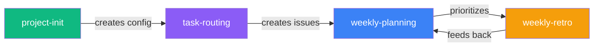

# Personal Corp Skills

[](README.md)
[](README.ru.md)
[](LICENSE)
[](https://github.com/serejaris/personal-corp-skills/actions/workflows/validate.yml)

> Public skills and plugin manifests for Claude Code and Codex: Personal Corp, product work, AI operations, and agent-assisted development.

By [Ris](https://t.me/ris_ai) — AI development & vibecoding

Русская версия: [README.ru.md](README.ru.md).

A collection of sanitized public skills, scripts, and workflows for [Claude Code](https://docs.anthropic.com/en/docs/claude-code) and Codex.

## Install

### Claude Code

Terminal:

```bash
claude plugin marketplace add serejaris/personal-corp-skills
claude plugin install personal-corp-skills@personal-corp-skills
claude plugin details personal-corp-skills
```

Claude Code Desktop or interactive `/plugin` flow:

1. Open **Plugins** or `/plugin`.
2. Add marketplace: `serejaris/personal-corp-skills`.
3. Install `personal-corp-skills`.

### Codex

This repo includes a Codex plugin manifest at [.codex-plugin/plugin.json](.codex-plugin/plugin.json).
Add the marketplace from GitHub, then install the plugin:

```bash
codex plugin marketplace add serejaris/personal-corp-skills
codex plugin add personal-corp-skills@personal-corp-skills
```

After installation, start a new Codex thread and try:

```text
Use Personal Corp skills to plan my week.
```

### Single Skill

Use this when you want one skill folder instead of the whole plugin:

> Install this skill: `https://github.com/serejaris/personal-corp-skills/tree/main/skills/cc-analytics`

Replace `cc-analytics` with any skill name from the table below.

## Skills

| Skill | What it does |
|-------|-------------|
| [art-director](./skills/art-director/) | Iterative visual style search with prompts, process logs, assets, and decision graphs |
| [product-data-audit](./skills/product-data-audit/) | Deep product/business audit → interactive HTML report with 12 sections |
| [cc-analytics](./skills/cc-analytics/) | HTML reports of Claude Code usage statistics |
| [ceo-council](./skills/ceo-council/) | Parallel sub-agents as C-level experts for strategic analysis |
| [claude-md-writer](./skills/claude-md-writer/) | Create and refactor CLAUDE.md files following best practices |
| [corp-new](./skills/corp-new/) | Add a private corp-* department repo and HQ entry after approval |
| [design-minimal](./skills/design-minimal/) | Standalone minimal HTML pages for dashboards, briefs, handouts, and reports |
| [gh-issues](./skills/gh-issues/) | Manage GitHub Issues via CLI with session context |
| [meeting-copilot](./skills/meeting-copilot/) | Live meeting dashboard: prepare, update from transcript chunks, close with decisions and follow-ups |
| [readme-generator](./skills/readme-generator/) | Human-focused README files with proper structure |
| [manager](./skills/manager/) | Bidirectional bridge between the current session and GitHub Issues |
| [prioritize](./skills/prioritize/) | Rank backlogs with RICE, ICE, MoSCoW, or Kano and produce a decision log |
| [html-draft](./skills/html-draft/) | One self-contained HTML diagram in flat engineering blueprint style — architecture, flows, spec sheets |
| [tg-bot-ops](./skills/tg-bot-ops/) | Reusable operations playbook for Telegram bots and Telegram-to-agent gateways |

### Design and Media Skills

| Skill | Use When |
|-------|----------|
| [art-director](./skills/art-director/) | Iterative art direction, visual style search, generation branches, and decision graphs |
| [design-minimal](./skills/design-minimal/) | Reading-first standalone HTML pages: dashboards, briefs, handouts, operating maps, reports |
| [html-draft](./skills/html-draft/) | Technical diagrams in flat engineering blueprint style: architecture, system flows, spec sheets |

### Telegram

| Skill | Use When |
|-------|----------|
| [tg-bot-ops](./skills/tg-bot-ops/) | Telegram bot and Telegram-to-agent gateway incidents, webhook/polling diagnostics, safe restart plans, Bot API smoke tests, forum topic delivery |

#### Personal Corp Framework

A system for running a business as one person with AI agents. GitHub becomes your operating system.



| Skill | What it does |
|-------|-------------|
| [project-init](./skills/project-init/) | Guided interview → GitHub Project + labels + CLAUDE.md config |
| [corp-new](./skills/corp-new/) | Register a private corp-* department repo and HQ entry after approval |
| [task-routing](./skills/task-routing/) | Route issues to the correct repo using routing config |
| [weekly-planning](./skills/weekly-planning/) | Retro findings + backlog → prioritized outcomes with Eisenhower matrix |
| [weekly-retro](./skills/weekly-retro/) | Structured retrospective: gather data, interview founder, capture findings |
| [manager](./skills/manager/) | Sync session work into GitHub Issues and query cross-repo task state |
| [prioritize](./skills/prioritize/) | Rank requirements and backlogs before planning |

## Other

### [Statusline](./statusline/)
Custom statusline showing costs, context usage, and git branch with color-coded indicators.

## Archived Skills

Archived skills are preserved for reference and are not part of the active
plugin skill set.

| Skill | Notes |
|-------|-------|
| [paperclip-api](./archive/skills/paperclip-api/) | Historical Paperclip API helper; kept for reference |

## Manual Installation

Skills are plain folders. Copy the whole skill directory so optional references
and examples are preserved:

```bash
cp -r skills/<name> ~/.claude/skills/
```

## Author

- Telegram: [@ris_ai](https://t.me/ris_ai) — AI development & vibecoding
- YouTube: [@serejaris](https://www.youtube.com/@serejaris)
- [vibecoding.phd](https://vibecoding.phd)

## License

MIT

## Security

Please report secrets, private data exposure, or exploitable behavior privately.
See [SECURITY.md](SECURITY.md).
