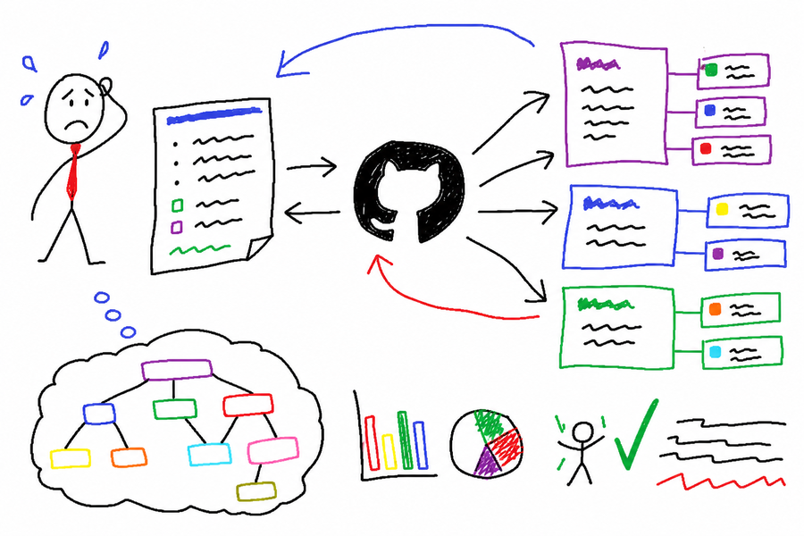

# Manager Skill



Двусторонний мост между текущей сессией и GitHub Issues. Часть фреймворка Personal Corp.

## Что это

Один скилл с двумя режимами:

- **Write mode (синк)** — в конце сессии: читает что было сделано, находит подходящие issues, обновляет тела/добавляет лейблы, создаёт новые только если нет совпадений.
- **Read mode (запрос)** — в любое время: «что по треку X?», «есть ли issue по Y?» → поиск по всем твоим репозиториям, сводная таблица с лейблами, статусом, активностью.

GitHub Issues — это твоя единственная правда по задачам. Скилл следит, чтобы каждый issue имел parent epic (через GitHub Sub-issues API), W-label (если включено в конфиге) и человекочитаемый title по формуле.

## Зачем нужно

Без такого моста ты:
- В конце сессии забываешь записать что сделал → задачи теряются.
- В начале сессии не знаешь что открыто по треку → роешься в issue-листе вручную.
- Создаёшь дубли, потому что не помнишь что уже есть.
- Получаешь orphan issues без parent epic — и через месяц не можешь собрать что относится к треку.

Скилл закрывает все четыре дыры: pre-flight чтение твоего индекса приоритетов, cross-repo поиск, проверка parent epic, человекочитаемый отчёт.

## Когда применять

**Write mode** — в конце рабочей сессии:
- Скажи «синкни сессию» / `/manager` / «обнови issues по тому что сделал»
- Скилл подтянет артефакты из контекста сессии, покажет план, выполнит апдейты.

**Read mode** — в начале или середине сессии:
- «Что по треку X?»
- «Какой статус по Y?»
- «Есть ли issue по Z?»

## Что получишь

**В write mode:** компактный план перед исполнением + отчёт после. Каждая строка — что обновлено, где, с каким parent epic, какие лейблы. Если у трека нет epic — скилл явно поднимет это в плане, не создаст orphan молча.

**В read mode:** таблица открытых issues по треку, с заголовками (без голых номеров), parent epic, W-label, активностью, статусом. Плюс отдельные секции:
- Не покрыто (пробелы) — что упомянуто в индексе, но issue под это нет
- Health-check трека — есть ли issues без parent, всё ли с W-label
- Drift в индексе / epic state — где индекс ссылается на CLOSED, где epic «висит» (100% sub-issues done, но state=open)
- Ложные совпадения — что отфильтровано и почему

## Установка

```bash
cp -r skills/manager ~/.claude/skills/
```

После этого скилл доступен в Claude Code.

## Настройка

Добавь в `CLAUDE.md` твоего проекта секцию `## Manager Config`. Минимальная настройка:

| Конфиг | Назначение |
|--------|------------|
| GitHub owner | Твой username или организация для cross-repo поиска |
| Repos to scan | Список репозиториев, в которых искать issues |
| Tasks index file (опц.) | Путь к файлу с приоритетами текущей недели (например `tasks.md`) — скилл читает его FIRST до любого `gh search` |
| Domain → repo routing | Маппинг доменов задач на репозитории (куда какой тип issue) |
| Issue title domains | Закрытый список доменов для формулы title (`product`, `partner`, `crm`, ...) |
| W-label convention (опц.) | Включить ли еженедельные лейблы (`W18`, `W19`...) |
| Standing write authorization | `ask-each-time` (по умолчанию) или `execute-after-plan` |
| CRM integration (опц.) | Путь к CRM и формат указателя в body issue |

Полный шаблон конфига — в `SKILL.md`, секция `## Setup`.

Без конфига скилл тоже работает, но менее targeted: будет переспрашивать про owner / repos на первом запуске.

## Как запустить

**Write mode (после сессии):**

> «синкни сессию»

или

> `/manager`

или

> «обнови issues по тому что сегодня сделал, и заведи новые где надо»

Скилл:
1. Силент pre-flight — читает индекс приоритетов, проверяет git status релевантных репо
2. Показывает компактный план (5-15 строк): что обновить / создать / привязать к какому epic
3. По авторизации из конфига — выполняет апдейты или просит подтверждения
4. Возвращает короткий отчёт «Готово / Пропущено»

**Read mode (запрос статуса):**

> «что по треку X?»

или

> «есть ли issues по Y?»

или

> «статус трека Z»

Скилл:
1. Cross-repo поиск по нескольким ключам (имя трека, handle, slug)
2. Фильтрует ложные совпадения, выносит их в отдельную секцию
3. Резолвит parent epic трека, проверяет sub_issues progress
4. Cross-reference с твоим индексом приоритетов
5. Возвращает таблицу + health-check + drift signals

## Железные правила

Скилл сам соблюдает три инварианта для каждого issue, который он трогает:

1. **W-label** (если convention включён в конфиге) — текущая или future-week. Лейбла нет в репо? Создаст.
2. **Parent epic** — ровно один parent через GitHub Sub-issues API. Если epic'а для трека нет — поднимет в плане, не создаст orphan.
3. **Track differentiation через title + epic membership** — никаких track-labels (`<track-slug>`, `<client>-deal`). Различение трека = текст title + чей это child.

## См. также

- [SKILL.md](SKILL.md) — полная спецификация: алгоритмы write/read mode, parent epic rules, W-label rules, title convention, output templates
- [README.md](README.md) — English version
- `weekly-planning` — куда уходит индекс приоритетов после ретро
- `weekly-retro` — `retro:W*` лейблы, на которые опирается manager
