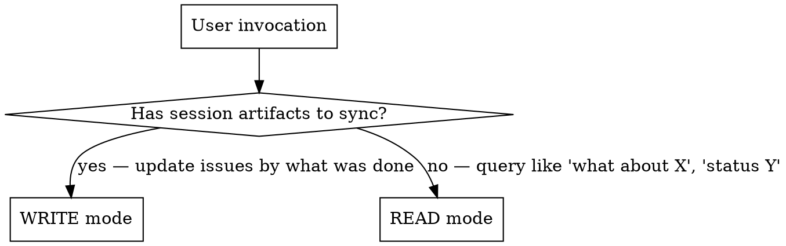
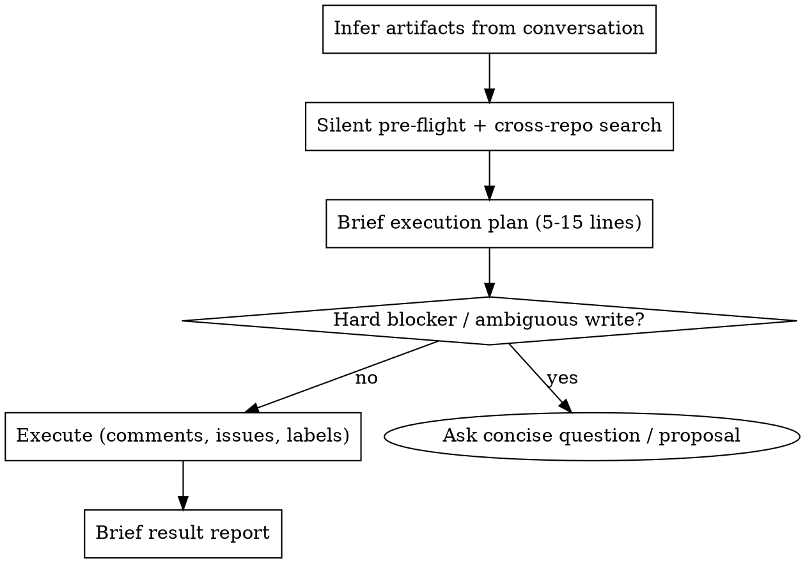

# Manager — bidirectional GitHub issues bridge

Part of the Personal Corp framework — running a one-person business through AI agents.

Bridges session work and GitHub issues in both directions. GitHub issues are the source of truth for tasks. Manager has two modes:

1. **Write mode (sync)** — at end of session: read what was done, find existing issues, update with progress, create new only if nothing matches.
2. **Read mode (query)** — anytime: «what about track X?», «status of Y?» → search across your repos, return condensed state of matching issues with current labels and last activity.

## Setup

Before first use, define this in your project's `CLAUDE.md`:

```markdown
## Manager Config

### GitHub owner
Your GitHub username or org for issue search:
- owner: your-github-handle

### Repos to scan (cross-repo issue search scope)
List repos manager should search:
- ~/Projects/main
- ~/Projects/ops
- ~/Projects/marketing

### Tasks index file (optional)
Path to your curated "what's hot this week" file. Manager reads it FIRST before any `gh search` to scope queries:
- tasks_index: ~/docs/tasks.md
(если файла нет — manager работает без индекса, поиск идёт по всем repos)

### Domain → repo routing
| Domain | Repo |
|--------|------|
| commercial / B2B deals | crm |
| product launches | main |
| ops / infrastructure | ops |
| content | marketing |

### Issue title domains (closed list)
Closed list used in title formula `{domain}: {object} — {action}`. Customize for your business:
- product, content, partner, crm, infra, legal, ops, meta

### W-label convention (optional)
- enabled: true
- format: W{NN} (ISO week)
(если false — manager создаёт issues без weekly labels)

### Standing write authorization
- mode: ask-each-time | execute-after-plan
(default: ask. execute-after-plan = manager executes writes after showing the brief plan, without separate confirmation)

### CRM integration (optional)
- crm_path: ~/Projects/crm
- crm_pointer_format: [[<slug>]]
(если не используется — секция игнорируется; см. CRM integration ниже)
```

No separate init skill needed — this section is the setup.

## Iron invariants

Every issue manager touches MUST have all three:

1. **W-label** (current or future week) — if W-label convention enabled in config. If label doesn't exist in repo — create it.
2. **Parent epic** — exactly one parent via GitHub Sub-issues API. Any issue that isn't itself an epic must have a parent. See "Parent epic rules" below.
3. **Track differentiation via title + epic membership** — no track-labels (`<track-slug>`, `<client>-deal`). Track is recognized by title text and epic membership.

Without all three — the issue isn't tracked correctly. If no parent epic exists in any repo — manager raises this in proposal and offers to create or pick an existing one, **before** sync. Never leaves orphan issues.

## Mode resolution



**Signal for write mode:** user said «sync session», «зафиксируй», «обнови issues», OR invoked `/manager` without args at end of session, OR explicitly listed artifacts/changes.

**Signal for read mode:** user asked a question about state — «what about», «status», «есть ли», «какие issues по».

**Bare `/manager` invocation:** infer artifacts from current conversation context — what tracks were touched, what files were modified/created, what decisions were made. Do NOT ask user to re-list everything. Form brief execution plan (5-15 lines), then execute under the configured authorization mode.

## Output language

Output language matches the user's input language and project conventions. Technical tokens remain as-is and are not translated: issue names (`<repo>#<N>`), labels (`W18`, `retro:W17`, `backlog`), commands (`gh issue comment`), file paths, original English titles of issues in quotes.

## Sources of truth (read every run)

1. **`$TASKS_INDEX_PATH`** (if configured) — current week index. Source for: what's hot this week, what tracks are active, repo pointers for each track. Read FIRST to frame the session.
2. **GitHub issues across `$YOUR_OWNER/*`** — authoritative for individual tasks. Search via `gh search issues --owner $YOUR_OWNER`.
3. **CRM artifacts** (if CRM integration enabled in config) — meeting cards, opportunity cards, person cards. NOT a substitute for a GH issue, but the linkage anchor: every comm-related issue body must include a CRM pointer.

## When to use vs when NOT

**Use (write mode):**
- User says "sync session" / "/manager" / "обнови issues по тому что сделал"
- End of working session with concrete artifacts (CRM updates, meeting cards, code commits, docs)

**Use (read mode):**
- Start or middle of session — user asks «what about <track>», «status», «is there an issue for»
- Need cross-repo state of a track without manually grepping
- Before deciding next step — check what's already open

**Do NOT use:**
- For creating new ideas without artifacts — use brainstorming
- For closing issues without explicit user instruction (see Common mistakes)

## Pre-flight (both modes) — HARD PRECONDITION

Pre-flight MUST run before any `gh search`, `gh issue`, or other GH command. No exceptions.

Keep pre-flight silent and minimal. Do not dump tasks index content, full git status, or label catalogues into chat. Read what you need internally, surface only what changes the proposal.

1. **Read `$TASKS_INDEX_PATH` FIRST** (if configured). This is the curated index of current-week priorities + active tracks + repo pointers. Without it, search is shotgun (random keywords) instead of targeted.
2. Check git status of relevant repos (silently). If specific artifacts referenced in session are uncommitted, mention only those by name in proposal.
3. Compute current ISO week if tasks index "Updated" line is stale (>7 days) or absent.

**Output budget for pre-flight: 0 lines.** All findings go into the proposal.

### Red flag: skipping tasks index

If you're about to run `gh search issues` without first reading `$TASKS_INDEX_PATH` (when configured) — STOP. You're about to do shotgun search instead of using the Project/track index that already exists.

## Write mode algorithm



**Authorization mode** (from your CLAUDE.md config):

- `ask-each-time` (default): after the plan, ask "execute?" before any GitHub write.
- `execute-after-plan`: after the silent pre-flight and brief execution plan, execute scoped GitHub writes without asking a separate confirmation. Still run pre-flight, search existing issues, preserve parent/W-label invariants, and report exactly what changed.

Either mode: ask before writing when the write is genuinely ambiguous or risky — no suitable parent epic, uncertain repo/track ownership, public-repo privacy risk, destructive/bulk changes, closing an issue whose scope is not clearly completed, or conflicting evidence.

## Read mode algorithm

1. Resolve query subject — track name, person, repo, issue number, time window.
2. Run cross-repo search via `gh search issues --owner $YOUR_OWNER` with multiple keys (synonyms, handles, slugs).
3. **Filter false-positives** — drop matches where keyword overlap is incidental (e.g. issue tagged `W18` but unrelated to the queried track). See "False-positive surface" below.
4. For each true match: pull title, state, current labels, last comment date, body excerpt (first 200 chars or "Status:" line if present).
5. **Resolve track epic** — find the parent epic for the track. Pull `sub_issues_summary` (`gh api repos/<owner>/<repo>/issues/<N> --jq '.sub_issues_summary'`) — note `total`, `completed`, `percent_completed` + epic's own `state`.
6. Cross-reference tasks index — does the track appear in current-week priority list? If yes, mark as "🔥 hot W{NN}". **Also verify the tasks index row for drift**: for each issue referenced in the row, check state and whether its scope still matches the row title. Flag if (a) referenced issue is already CLOSED, (b) scope mismatch, (c) row implies open work that no longer exists.
7. Output: condensed table of matches + open questions + "what's NOT covered yet" gaps + drift surface.

### Drift signals to always surface

- **Epic stale-open:** epic with `sub_issues_summary.percent_completed = 100` AND `state = open`. Candidate for closing. Surface as "stale epic" — don't close without user instruction.
- **Tasks index row drift:** row references issues that are closed or off-topic for the row title. Surface as "drift in tasks index" so user can re-curate (manager stays read-only on the index file).
- **Carry-over confusion:** row title names track X but >50% of open referenced issues are about track Y. Means the row is a leftover header from a previous week.

## Search for existing issues — how

For each artifact or query subject, search by **multiple keys** to avoid missing matches. For simple unambiguous tracks (single-keyword) one query is enough — escalate to multi-key only when first query returns 0 or 5+ matches:

```bash
gh search issues --owner $YOUR_OWNER --state open <key> --json repository,number,title,labels,updatedAt
```

**Keys to try (per artifact/subject):**
- Person name + slug (different transliterations): `"<person-name>"`, `<handle>`, `<filename-slug>`
- Company / track: `<track-A>`, `<track-B>`, `<client>`
- Telegram/social handle if mentioned: `<handle>`
- Filename slug from any CRM artifact: `<opportunity-slug>`

**Match acceptance criterion:** issue title or body references the same person/company/track AND scope of work overlaps. If 2+ candidates match — pick the most specific one and link the others in the comment ("related: #N").

## False-positive surface (read AND write mode)

Search by W-label or generic terms can return issues that **share a label but aren't on this track**. Example: `<repo>#1` returned for `<track-A>` query because both have `W18` label.

**Rule:** if a search match's title/body has no overlap with the queried track besides W-label or other generic label — it's a false positive. Drop it from results, surface in report under `IGNORED (false positives)` so user can confirm.

```
IGNORED (false positives):
- <repo>#1 — surfaced via W18 label match, but track = <unrelated track>
```

Don't silently filter — show what was filtered and why, in case user spots a real link manager missed.

## Parent epic rules

Every issue (except the epic itself) must have **exactly one** parent via GitHub Sub-issues API. This is machine-readable track differentiation — replaces track-labels and stale markdown pointers in body.

### What counts as an epic

- An issue that has sub-issues (counter `N / M` shown at top)
- Title typically contains track scope: `epic:`, `<program>: <partner> — overview`, `ops: <deal> — overview`, `<product>: delivery <version>`
- An epic itself does NOT have a parent — it's the root of the tree

### One epic per issue

GitHub supports only one parent via Sub-issues API. This matches: «one track — one hierarchy». If a task seems to relate to two tracks — reconsider scope: probably split into two issues, one per track.

Do not use markdown `Parent: #N`, `Epic: #N`, `Belongs to: #N` in body when parent is set via API — it's a duplicate that goes stale. Parent is stored via the Sub-issues API only.

### Resolve epic — algorithm at creation / sync

1. **First, search for an existing epic** for the track via cross-repo search:

   ```bash
   # Issues with non-empty sub_issues_summary.total are epic candidates
   gh search issues --owner $YOUR_OWNER "<track-keyword>" --json repository,number,title,url --limit 20
   # For each, verify:
   gh api repos/<owner>/<repo>/issues/<N> --jq '{title, sub_summary: .sub_issues_summary}'
   ```

   Working epics always have `total >= 1`.

2. **Canonical mapping by domain** (configure per your business in `Domain → repo routing`):

   | Track domain | Epic lives in |
   |--------------|---------------|
   | Educational program / partnership | teaching domain repo |
   | B2B deal / multi-lane commercial track | crm / commercial repo |
   | Product launch | the product's own repo |
   | Research initiative | research repo |

3. **If no epic exists** — manager raises in proposal: «no epic for track X, do you want one? If yes — I'll create in `<repo>` with title `<...>`». **Never creates an issue without a parent silently.**

4. **When creating a sub-issue** via API:

   ```bash
   CHILD_ID=$(gh api repos/OWNER/REPO/issues/CHILD_NUMBER --jq '.id')
   gh api -X POST repos/EPIC_OWNER/EPIC_REPO/issues/EPIC_NUMBER/sub_issues -F sub_issue_id=$CHILD_ID
   ```

### No track-labels

Track-labels (`<track-slug>`, `<client>-deal`) are NOT created. Track differentiation goes through title + epic membership. Existing legacy track-labels are not deleted (they're history), but no new ones are created. Cross-repo navigation by track = epic's sub_issues + Project board, not label filter.

### Verification before sync

Before `gh issue edit` / `gh issue create` the agent MUST:

```bash
# (1) If working with an existing issue — what's its parent?
gh api repos/OWNER/REPO/issues/N --jq '{parent: .parent_issue_url, sub_summary: .sub_issues_summary}'

# (2) If parent is absent and the issue is not itself an epic — search for the epic, don't bypass the check
```

Surface in proposal which issues are missing a parent and which epic is proposed for each.

## W-label rules

(Skip this section if W-label convention is disabled in your config.)

### Current-week resolution

1. Read tasks index first line under your "Updated" marker — canonical signal for current week.
2. Compute ISO week from `date '+%V'` if index is stale (>7 days).
3. Map to label format: `W{NN}` (zero-padded only if existing labels in repo are zero-padded — check repo first).

### Multi-week tasks

If a task requires action this week AND continues next week — apply BOTH W-labels. Don't pick "the most prominent" — both apply. The index file is for "what's hot now"; labels record full lifecycle.

### Backlog vs future-week

- If task is **deferred more than 1 week** without active work → `backlog` (create label if missing).
- If task is **planned for a specific future week** (e.g. workshop in W20) → `W{NN}` for that week.
- Never use `backlog` AND `W{NN}` together — pick one.

### Creating W-labels on demand

```bash
# W-week label (current/future week)
gh label create "W18" -R "$REPO" \
  --color "0E8A16" \
  --description "Week 18 (Apr 27 - May 3, YYYY)"

# backlog label
gh label create "backlog" -R "$REPO" \
  --color "ededed" \
  --description "Deferred — not on current/next week"
```

Color `0E8A16` (dark green) for active weeks, `ededed` (neutral grey) for backlog.

## Issue title convention

All new issues created by manager follow a fixed formula — canonical operational layer for agents (predictable parsing, search, groupBy).

### Formula

```
{domain}: {object} — {action} ({when / context})
```

| Segment | What | Examples |
|---------|------|----------|
| **`{domain}`** | Closed list from your config. Lowercase. | `ops`, `content`, `partner`, … |
| **`{object}`** | Concrete subject (noun, first position) | `<track-A>`, `<product> L3`, `<deal>`, `<handle>`, `<topic>` |
| **`{action}`** | Verb + short scope | `prep for meeting <date>`, `process response + slot intake` |
| **`{when / context}`** | Date/window/week in parens at end; optional | `(by <date>)`, `(<date> <time>)` |

### Rules

1. **`{domain}` always from the closed list** in your config — don't proliferate variants.
2. **`{object}` is a noun first** for search ease (`partner: <track-A>` groups all that track's tasks).
3. **`em-dash (—)` separator** between object and action — visual anchor, easy to parse.
4. **Date in parens at the end**, not in the middle. Predictable placement.
5. **No emojis in title** — clutter search and sorting.
6. **Lowercase domain**, rest follows context (companies / handles / abbreviations keep their case).

### Examples (replace placeholders for your domain)

- `partner: <track-A> — prep meeting <date> + budget by <date>`
- `mentoring: <person-name> (<handle>) — process response + intake + slot`
- `product: <product> L3 — final prep for live (<date> <time>)`
- `content: <channel> — post recap <month> YYYY`
- `legal: <topic> — complete registration, overdue W17`
- `infra: <service> — full-coverage sync without backlog`
- `meta: cross-repo W-label — finalize canonical approach`

### Anti-patterns

- ❌ `Sprint 2 pre-record — setup warp/claude...` — no domain
- ❌ `🔥 <track>: KP` — emoji in title
- ❌ `prep meeting on <date> for <track>` — verb-first instead of noun-first
- ❌ `ops: all about <event>` — too generic, no concrete action
- ❌ `partner: <track> → divergence ⚠️ overdue` — arrow instead of em-dash, emoji

### When migrating existing issues

If manager touches an issue with an old title — **don't rename automatically**. Only rename if user explicitly asked for bulk-rename. Migration of existing issues is a separate task.

## Update vs create decision

**Default: update issue body, NOT add a comment.** Body = single source of truth, readable as one document. Comments stack chronologically and become unreadable after 5+ entries — user ends up scrolling through history to find current state.

| Situation | Action |
|-----------|--------|
| Existing issue covers same scope, same track | **Edit body** — refresh "Status:", "Next:", and dated line in `## Updates`. Verify W-label is current AND parent epic is attached (if no parent — surface in proposal). |
| Existing issue scope is narrower (e.g. `prep meeting`) but session expanded scope | Edit body of existing + create new follow-up issue with expanded scope. New issue is a child of the same epic. |
| Multiple existing issues match different aspects (e.g. parent epic + sub-issue) | Edit body of the most specific child; touch epic only if its body needs updating. |
| No existing issue matches, but track is in tasks index | Create new issue. First resolve parent epic for the track. If epic exists — link via sub_issues API. If not — surface in proposal: «no epic, create / pick?». W-label current. |
| No existing issue, no track in tasks index, fresh artifact | Ask user which repo + which epic before creating |

### Comment is fallback, not default

Use a comment ONLY when:

- The note is genuinely chronological and ephemeral (e.g. "blocked by external party until <date>") — would clutter body.
- User explicitly asked for a comment.
- Body update would lose distinct meaningful history (rare — usually history goes into `## Updates` section in body).

**Anti-pattern signal:** if you're about to write the third comment on an issue with the same kind of progress update — that's two too many. Edit body instead.

### Body update mechanics

Manager owns the read-modify-write pattern: `gh issue view` → local body file → `gh issue edit --body-file`, with refreshed `Status` / `Next` / `## Updates`. Use standard `gh` CLI directly per the rules in this skill.

## Issue body template (when creating new)

```markdown
<one-line context: what changed/what was made>

**Source artifact:** <absolute path or URL>
**Date:** <YYYY-MM-DD>
**Track:** <link to CRM card if commercial — see CRM integration>

## What was done
<2-4 bullets — actual progress>

## Next step
<one line — what closes this issue>

---
Synced by manager from session <YYYY-MM-DD>.
```

## Body update template (default)

```markdown
<one-line context: what changed/what was made — same as before, refresh if scope changed>

**Status:** <active / blocked / pending external / done — only "done" if user said so>
**Next:** <one-line next concrete step — refresh on each sync>

[... rest of original body content ...]

## Updates

- **YYYY-MM-DD:** <2-4 bullets of progress / decisions / shifts in this sync>
- **YYYY-MM-DD:** <previous sync entry, kept>
- ...
```

Newest update at top of `## Updates` section, oldest at bottom (or vice versa — pick once per issue and stay consistent within it).

## Comment template (fallback only)

```markdown
**YYYY-MM-DD:** <one-line note that doesn't fit body — e.g. "external blocker until X", "transient state observation">
```

Keep comments short. If a comment grows beyond 4 lines — it belongs in body.

## Output format

### Issue reference format (CRITICAL)

**Always use `<repo>#N — «human title»` form when surfacing an issue to the user.** Bare `<repo>#27` is unreadable — user needs the title to recognize the track at a glance.

- ❌ Bad: `<repo>#27 → comment + W19`
- ✅ Good: `<repo>#27 «<track-A> · strategy — respond to brief» → comment + W19`

In compact lists, you may put title in quotes/parens; in tables, title goes in its own column. Never just the number.

### Write mode — plan (BEFORE execution)

Compact plan. Each line: what I'll do + where + why. Group by track. Under each track, first line — **epic** (parent issue), then sub-issues with `parent: OK / parent: MISSING` marker. Decisions / ambiguities — inline as questions.

```
Sync plan (W18, <date>):

<track-A> · epic crm#15 «<track-A>: B2B deal — overview»
- crm#27 «<track-A> · strategy track — respond to brief»  [parent: crm#15 ✓]
  → comment about pricing / timeline; +W19 (next step in W19)
- crm#25 «<track-A>: prep meeting <date> + final <date>»  [parent: crm#15 ✓]
  → comment "both meetings done"; close if prep scope fully done; else keep open with reason

<track-B> · epic crm#10 «<track-B>: partnership Q2»
- crm#24 «<track-B>: opp divergence + overdue»  [parent: crm#10 ✓]
  → comment about async-first + scope expansion
- teach-vibecoding#250 «<track-B>: program in LMS»  [parent: MISSING]
  → attach as child crm#10 + comment about video by <date>
- NEW issue in crm: «<track-B>: scope expanded without re-pricing — raise on sync by <date>» (W18+W19, child crm#10)

Labels to create: W19 in $YOUR_OWNER/crm
Epics missing coverage:
- (none — all session tracks have an epic)

Uncommitted in crm: meetings/<date>.md (new) — commit before sync?

Proceeding under standing authorization. If scope looks wrong — stop / correct.
```

If a track has **no working epic**, surface separately:

```
⚠️ Epic missing: track «<X>» has no parent epic. Options:
   - Create crm#NEW «ops: <X> — overview» as umbrella; all 3 issues below become sub-issues.
   OR
   - Use existing <repo>#N «<title>» (sub_summary total=N) — ask if ambiguous.
```

### Write mode — report (AFTER execution)

```
Done:
- crm#27 «<track-A> · strategy track» — body update + W19; parent: crm#15 ✓
- crm#24 «<track-B>: opp divergence» — body update; parent: crm#10 ✓
- teach-vibecoding#250 «<track-B>» — body update + attached as child crm#10
- crm#42 «<track-B>: scope expanded» — created, child crm#10, W18+W19
- W19 label created in $YOUR_OWNER/crm

Skipped per your decision: crm#25 «<track-A>: prep…» — left open
```

### Read mode

Compact table — always with a «Title» column, parent epic in its own column, no bare numbers:

```
Query: «what about <track-A>»

Epic of the track: crm#15 «<track-A>: B2B deal — overview» (3/5 done)

Open sub-issues:
| Issue | Title | Parent | W-label | Activity | Status |
|-------|-------|--------|---------|----------|--------|
| crm#27 | <track-A> · strategy — respond to brief | crm#15 ✓ | W18 | <date> | Active — KP due <date> |
| crm#25 | <track-A>: prep <date> + final <date> | crm#15 ✓ | W18 | <date> | Both meetings done — likely stale |
| corp-decks#9 | <track-A>: deck — express audit | — ⚠️ | W18 | <date> | No parent, attach to crm#15 |

In tasks index:
- 🔥 W18 priority 4 — «KP for <track-A> by <date>»

Not covered (gap):
- No issue for writing the KP itself (only prep). Create on next sync?

Track health check:
- 1 issue without parent epic — corp-decks#9. Attach on next sync.
- W-label OK on all 3.

Drift in index / epic state:
- (optional) crm#15 epic — 5/5 sub-issues done, state OPEN. Candidate to close.
- (optional) tasks index row «X» references crm#NN that's already CLOSED — index stale.

Filtered (false positives):
- crm#1 «<unrelated>: complete» — surfaced via W18 label, unrelated to <track-A>
```

## Cross-references

- For weekly index management (when current week changes): see `weekly-planning` skill.
- For retro-driven backlog (when `retro:W*` labels appear): see `weekly-retro` skill — these labels carry historical signal, don't strip.

## Common mistakes

| Mistake | Fix |
|---------|-----|
| Closing issues without explicit user instruction | Comment-and-leave-open is default. Only close if user said "close" or issue scope is fully delivered AND user mentioned completion. |
| Removing legacy labels (`retro:W17`, etc.) for "tidiness" | Don't strip labels you didn't add. Append new W-label, leave legacy. |
| Picking single W-label for cross-week task | If task spans current week + next week, apply both. See W-label rules. |
| Creating new issue when comment in existing fits | Search broadly first. Multiple keys. Only create if scope clearly diverges. |
| Skipping W-label create when missing in repo | Iron invariant — every issue must have W-label (if convention enabled). Create the label, don't skip. |
| Creating/touching an issue without a parent epic | Iron invariant — every issue (except the epic itself) must have a parent via Sub-issues API. If parent is absent — surface in proposal, don't be silent. |
| Creating a new track-label (`<track-slug>` etc.) | No longer done. Track differentiation = title + epic membership. Existing legacy labels are kept but not extended. |
| Attaching one issue to two epics | GitHub supports one parent. If a task relates to two tracks — reconsider scope, split into two issues, one per track. |
| Markdown `Parent: #N` in body when API link exists | Duplicate, goes stale. Parent — only via Sub-issues API. Body — what the task is and how to do it. |
| Not respecting public-repo gate | Before writing to a public repo, do not add private / CRM / personal details; if unsure — surface in proposal and ask. |
| Treating tasks index as a task list to mutate | The tasks index file is read-only context for manager. Don't edit it. Index is curated by user / `weekly-planning` skill. |
| Acting on uncommitted local changes as "done" | If `git status` shows uncommitted work — surface in `UNCOMMITTED` section of report. Don't block sync, but flag so user can commit before issue comments link to a not-yet-pushed artifact. |
| Silently filtering false-positive matches | Drop from primary results but show in `IGNORED (false positives)` section. Don't hide — user may spot a real link manager missed. |
| Treating every invocation as write mode | Check first: did user give artifacts/changes (write) OR ask a question about state (read)? Use mode resolution diagram at top of skill. |

## Anti-patterns

- **Creating an issue without a parent epic** — breaks iron invariant. If no epic — surface in proposal, don't create orphan.
- **Creating new track-labels** — no longer done. Differentiation = title + epic membership.
- **Attaching one issue to two epics** — one parent per issue. If a task relates to two tracks — reconsider scope, split.
- **Markdown `Parent: #N` / `Epic: #N` in body when parent is set via API** — duplicate, goes stale. Body = what the task is; parent = Sub-issues API.
- **Auto-closing stale issues** — never. Surface to user, leave open.
- **Mutating tasks index** — manager is read-only on it.
- **Silent skip on tasks index drift** — if an index row references closed or off-topic issues, surface explicitly under "Drift in index". User may not realize the row is stale.
- **Silent skip on epic stale-open** — epic with 100% sub-issues completed but `state = open` is a real signal: either delivery has loose ends not captured as sub-issues, or epic is closeable. Surface as candidate-to-close; never auto-close.
- **Single mega-comment dumping whole session** — one comment per issue, scoped to that issue's track.
- **Creating issues across repos for the same artifact** — one artifact = one primary issue (in the repo where the artifact lives or the track owner repo).
- **Skipping search** — always search before create. Bias toward update.
- **Dumping full investigation output to chat** — no full git status, no full label catalogues, no full tasks index content. All readings are silent; only the proposal is visible.
- **Asking user to re-list session artifacts** — infer from conversation context. Only ask if context is genuinely empty (fresh session with no prior work).
- **Bare issue numbers** — never `<repo>#27` alone. Always `<repo>#27 «title»`. Numbers are unrecognizable; titles convey track at a glance.
- **Skipping tasks index before gh search** — when configured, the tasks index gives targeted scoping. Without it, `gh search` is shotgun across random keywords. Pre-flight is not optional.
- **Suggesting user open a URL/issue/file manually** — never. The user works through the agent. If detail on a specific issue is needed in read mode (body, comments, history) — `gh issue view <repo>/<N> --comments` yourself and bring the content back. Don't hand the work back to the user.
- **Adding comments instead of updating body** — the main channel is body. Comments stack chronologically and become unreadable after 5+ entries. Default = `gh issue edit --body-file` with refreshed Status/Next + dated entry in `## Updates`. Comment only if note is genuinely ephemeral or user explicitly asked.

## CRM integration (optional)

Activate by setting `crm_path` and `crm_pointer_format` in your CLAUDE.md config.

When CRM integration is enabled, every commercial / communication-related issue body must include a pointer to the corresponding CRM artifact (person card, opportunity card, meeting note). Default pointer format is `[[<slug>]]` (Obsidian wiki-link style), but you can configure any format your CRM uses.

Example body fragment:

```markdown
**Track:** [[<opportunity-slug>]]
```

Manager checks the CRM path exists when activated; if it doesn't — surfaces a one-line warning and proceeds without the pointer requirement.
