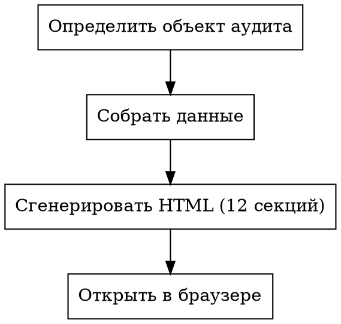

# Product & Data Audit

Глубокий аудит продукта/бизнеса: данные, системы, решения, узкие места, контуры внедрения. На выходе — интерактивная HTML-визуализация (12 секций). Markdown-версия — опционально по запросу.

## Процесс



### 1. Определить объект аудита

Спросить у пользователя, если неочевидно:
- Аудит одного продукта, линейки или всей экосистемы бренда?
- Какие файлы/системы читать?

`workdir` = корень git-репозитория текущего проекта. Если неочевидно — спросить у пользователя до шага 2.

### 2. Собрать данные

Обнаружить и прочитать источники по категориям (конкретные файлы зависят от проекта):

1. **Архитектура проекта** — CLAUDE.md, README, AGENTS.md, .cursor/rules, любые конфиг-файлы агентов
2. **Канонические данные** — файлы с ценами, метриками, офферами, аудиторией (искать по содержимому, не по имени)
3. **Стратегия и планы** — документы с insights, roadmap, OKR, ретро, планы
4. **Операционные правила** — правила в .claude/rules/, playbooks, runbooks
5. **Рабочие документы** — docs/, notes/, analysis/ — всё что есть
6. **Управление задачами** — GitHub Projects/Issues, Linear, Jira (если доступны через CLI)
7. **Системы и конфиги** — боты, CRM, базы, аналитика, мониторинг (конфиги, схемы, .env.example)
8. **Внешние данные** — API-запросы, CLI-команды для свежих метрик (если доступны)

Для каждого источника фиксировать: что внутри, дата snapshot, качество, ограничения.

**Обнаружение источников:** начать с `CLAUDE.md` / `README.md` в корне — они обычно описывают структуру проекта и указывают на канонические файлы. Затем `ls` + `glob` по корню для обнаружения остального.

**Свежесть данных:** если snapshot старше 14 дней — добавить `[snapshot: YYYY-MM-DD]` рядом с числом. Если старше 30 дней — пометить `[УСТАРЕЛО: YYYY-MM-DD]`.

**Если канонические файлы не найдены:** пометить числовые утверждения `НЕИЗВЕСТНО. [источник не найден]` и продолжить аудит с доступными данными.

### 3. Сгенерировать отчёт

Основной артефакт = **HTML** (`{workdir}/research/product-data-audit.html`). Markdown-версия (.md) — опциональна, генерировать только по явному запросу пользователя.

Структура — 12 секций (0–11), см. references/report-structure.md. Секция 0 = диаграмма экосистемы.

**Тегирование:** каждое утверждение маркировать:
- `ФАКТ.` — подтверждено данными, указать источник
- `ГИПОТЕЗА.` — логичный вывод, требует проверки
- `НЕИЗВЕСТНО.` — слепое пятно, данных нет

**Правило числовой конкретики (обязательно):**
- Каждый ФАКТ должен содержать **конкретные числа**, если они доступны в источниках
- После числа — **ссылка на источник** в формате `[файл:строка]` или `[система → запрос]`
- Если число можно получить запросом (SQL, API, file read) — получить, не оставлять "самый маржинальный"
- Плохо: "канал X — самый маржинальный"
- Хорошо: "канал X — $Y/единица, ~$Z/час при Nч работы [<файл-с-ценами>:<метка>]"
- Если число недоступно — явно пометить `[число не найдено]` вместо голого утверждения

**Терминология:** русский язык, англицизмы только для устоявшихся стандартов (CRM, API, KPI). См. references/terminology.md.

**Рекомендации по отсутствующим артефактам:** в секции 7 (контуры внедрения) проверить наличие 18 операционных артефактов из references/missing-artifacts-checklist.md. Отсутствующие — включить как рекомендации с приоритетом и минимальной версией. 4 категории: стратегия (NSM, OKR), AI-native (CLAUDE.md, промпты, runbook), инфраструктура данных (SSOT, определения метрик), governance (журнал решений, эскалация).

### 4. Сгенерировать HTML

Создать `{workdir}/research/product-data-audit.html` по дизайн-спецификации из references/html-design-spec.md. Навигация = 12 секций (0–11).

### 5. Открыть в браузере

```bash
open {workdir}/research/product-data-audit.html
# Если `open` недоступна — вывести абсолютный путь для ручного открытия
```

## Типичные ошибки

| Ошибка | Как избежать |
|--------|-------------|
| Англицизмы при наличии русского аналога | Проверять references/terminology.md |
| Факт без источника | Каждый `ФАКТ.` ссылается на файл/систему |
| Факт без числа | Если число доступно — получить и указать. "Самый маржинальный" → "$Y/единица, ~$Z/час [источник]" |
| Stale данные без маркировки | Snapshot > 14 дней → `[snapshot: дата]`, > 30 дней → `[УСТАРЕЛО: дата]` |
| Смешение фактов и гипотез | Не приписывать уверенность неподтверждённому |
| Нет диаграммы экосистемы | Секция 0 обязательна: SVG с 4 слоями и потоками между нодами |
| Нет секции "Неизвестное" | Слепые пятна важнее фактов для решений |
