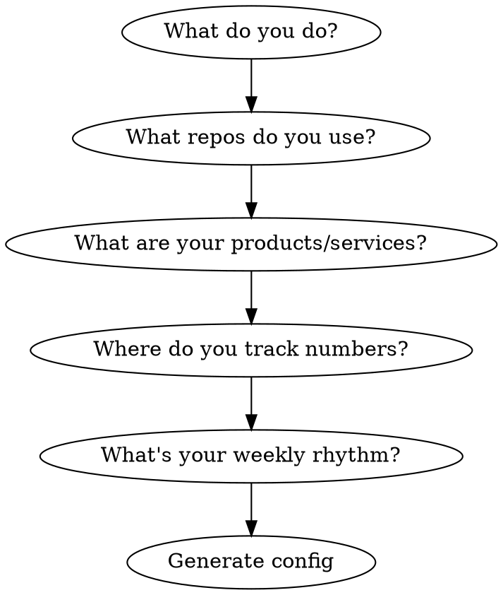

# Project Init

Set up GitHub as your business operating system through a guided interview. Part of the Personal Corp framework — a system for running a business as one person with AI agents.

## What This Does

Interviews you about your work, then creates the infrastructure for agent-driven project management:
- GitHub Project with the right fields
- Labels for retro/planning cycles
- CLAUDE.md config block so other skills (weekly-retro, weekly-planning) know your setup
- Canonical files for single-source-of-truth data

## Phase 1: Interview (one question at a time)

### Question flow



1. **What do you do?** — Business type, role, solo or team. Keep it conversational.
2. **What repos do you use?** — List them. Check with `gh repo list --limit 30`. Categorize: execution, growth, infrastructure.
3. **What are your products/services?** — What you sell, pricing, where it lives.
4. **Where do you track numbers?** — Revenue, users, metrics. This becomes your canonical files list.
5. **What's your weekly rhythm?** — Delivery days, meetings, deep work blocks. This shapes retro/planning cadence.

### Rules

- **One question at a time** — don't overwhelm
- **Verify what exists** — `gh project list`, `gh label list`, check for existing CLAUDE.md
- **Don't overwrite** — if CLAUDE.md exists, ADD config block, don't replace

## Phase 2: Generate Config

Create the config block for CLAUDE.md:

```markdown
## Agent Operations Config

### Repos (scanned during retro/planning)
repos:
  - owner/repo-1    # execution — what it does
  - owner/repo-2    # growth — what it does
  - owner/repo-3    # infrastructure — what it does

### GitHub Project
project_id: N       # gh project list --owner {owner}
owner: {github-username}

### Canonical Files (single source of truth)
canonical:
  numbers: data.md          # revenue, users, metrics
  products: product.md      # current offers and pricing
  insights: insights.md     # lessons learned

### Task Routing (which issues go where)
routing:
  - pattern: "bot, broadcast, onboarding"
    repo: owner/bot-repo
  - pattern: "content, lessons"
    repo: owner/content-repo
  - pattern: "strategy, cross-cutting"
    repo: owner/main-repo

### Retro/Planning
retro_label_prefix: "retro"    # creates retro:W{NN}
retro_log_path: "docs/activity-log/"
weekly_cadence: "Thursday"      # main delivery day

### Interview Topics (for weekly-retro)
interview_order:
  - "Delivery — main product/service output"
  - "Clients/Users — new, churned, notable"
  - "Calendar events — verify each one"
  - "New initiatives — what started, why"
  - "Open question — anything else?"
```

Show the generated config to the user. Ask: "Does this look right?"

## Phase 3: Create Infrastructure

After user confirms:

```bash
# 1. Create GitHub Project (if doesn't exist)
gh project create --owner {owner} --title "{Project Name}"

# 2. Add custom fields
# Status: Todo / In Progress / Done
# Deadline: date
# Week: single-select (configurable)

# 3. Create labels in each repo
for repo in {repos}; do
  gh label create "retro:W00" -R $repo --color "D4C5F9" --description "Weekly retro backlog template"
  gh label create "epic" -R $repo --color "FF6B6B" --description "Epic / initiative"
done

# 4. Create canonical files (if they don't exist)
# Only create stubs — don't fill with fake data

# 5. Append config block to CLAUDE.md
```

## Phase 4: Verify

```bash
# Check project exists
gh project list --owner {owner}

# Check labels
for repo in {repos}; do
  gh label list -R $repo | grep retro
done

# Check CLAUDE.md has config
grep "Agent Operations Config" CLAUDE.md
```

Show results. Confirm everything works.

## What Happens Next

After init, you can use:
- **weekly-retro** — structured retrospective using your config
- **weekly-planning** — prioritize backlog into weekly outcomes

Each skill reads the config block from CLAUDE.md — no re-configuration needed.

## Red Flags — STOP

- Existing CLAUDE.md with content → ADD config block, don't overwrite
- Existing GitHub Project → ask if they want to use it or create new
- User unsure about repos → `gh repo list` and walk through together
- User doesn't use GitHub → this framework requires GitHub. Suggest alternatives or help set up.

## Common Questions

**"I have 20+ repos"** — Pick the 5-7 that matter for weekly operations. The rest can be added later.

**"I don't track numbers anywhere"** — Start with one file. Even `data.md` with three lines is better than nothing. The retro skill will remind you to update it.

**"My project structure is messy"** — That's fine. Init creates a clean layer on top. You don't need to reorganize first.
