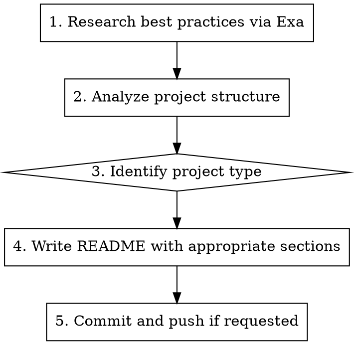

# README Generator

Generate human-focused README files following current best practices.

**Core principle:** README is for humans, not agents. Research → Analyze → Write.

**Model recommendation:** Use `Task` tool with `model: haiku` for README generation — faster and cheaper for documentation tasks.

## When to Use

- Creating README for new project
- Rewriting outdated README
- User asks "write/create/update README"

## Process



## Step 1: Research

**Always search first** for current README best practices:

```
mcp__exa__web_search_exa: "best practices README.md {year} {project_type}"
```

Look for:
- Current trends in README structure
- Examples from similar projects
- What sections are essential vs optional

## Step 2: Analyze Project

Read these files to understand the project:
- `CLAUDE.md` or existing docs
- `package.json` / `pyproject.toml` / `Cargo.toml`
- Main entry points
- Test files (understand features)

## Step 3: Identify Project Type

| Type | Key Sections |
|------|--------------|
| **CLI Tool** | Usage examples, Options table, Installation |
| **Library/SDK** | API overview, Quick start, Examples |
| **Web App** | Features, Quick start, Architecture diagram |
| **Full-stack** | Architecture, Quick start both parts, Tech stack |
| **AI/ML** | Model info, Requirements (GPU), Examples |

## Step 4: README Structure

**Essential (all projects):**

```markdown
# Project Name

**One-line value proposition.**

Brief description (2-3 sentences max).

## What It Does / Features
- Bullet points of capabilities
- Focus on VALUE not implementation

## Quick Start
Minimal steps to get running (< 5 commands)

## Requirements
- Runtime versions
- System requirements
- Disk space if significant

## Usage
Examples for common cases

## Tech Stack (if non-trivial)
Table format preferred

## License
```

**Optional by project type:**

| Section | When to Include |
|---------|-----------------|
| Architecture diagram | Web apps, full-stack, complex systems |
| Project Structure | Open source, contribution expected |
| API Reference | Libraries, SDKs (or link to docs) |
| Related Skills | If Claude Code skills exist |
| CLI Options table | CLI tools |
| Configuration | Apps with config files |
| Known Limitations | If significant gotchas exist |

## Writing Style

**DO:**
- Start with value, not implementation
- Use active voice
- Keep sentences short
- Include runnable examples
- Write for humans scanning quickly

**DON'T:**
- Include API reference for internal use
- Write walls of text
- Use jargon without explanation
- Include every possible option

## Related Skills Section

If project has Claude Code skills, add:

```markdown
## Related Skills

| Skill | Trigger | What it does |
|-------|---------|--------------|
| `skill-name` | "trigger phrase" | Brief description |
```

## Quick Reference

| Project has... | Include |
|----------------|---------|
| Web UI | Screenshot or architecture |
| CLI | Options table, examples |
| API | Endpoint summary (not full docs) |
| AI/ML | Model, hardware requirements |
| Claude skills | Related Skills table |
| Complex arch | Mermaid diagram |

## Common Mistakes

| Mistake | Fix |
|---------|-----|
| API docs dump | Link to separate file or remove |
| No quick start | Add "clone → run" in < 5 steps |
| Wall of text | Use bullets, tables, code blocks |
| Missing requirements | Always list runtime + system reqs |
| Generic description | Start with specific value prop |

## Example Structure (Full-stack App)

```markdown
# Project Name

**Value proposition in one line.**

Brief description.

## Features
- Feature 1
- Feature 2

## Quick Start
\`\`\`bash
./start.sh
\`\`\`

## Requirements
- OS/hardware
- Runtime versions

## Tech Stack
| Layer | Stack |
|-------|-------|

## Architecture
\`\`\`mermaid
flowchart...
\`\`\`

## Project Structure
\`\`\`
project/
├── ...
\`\`\`

## Related Skills
| Skill | Trigger | Description |

## Development
How to test, build

## License
```
