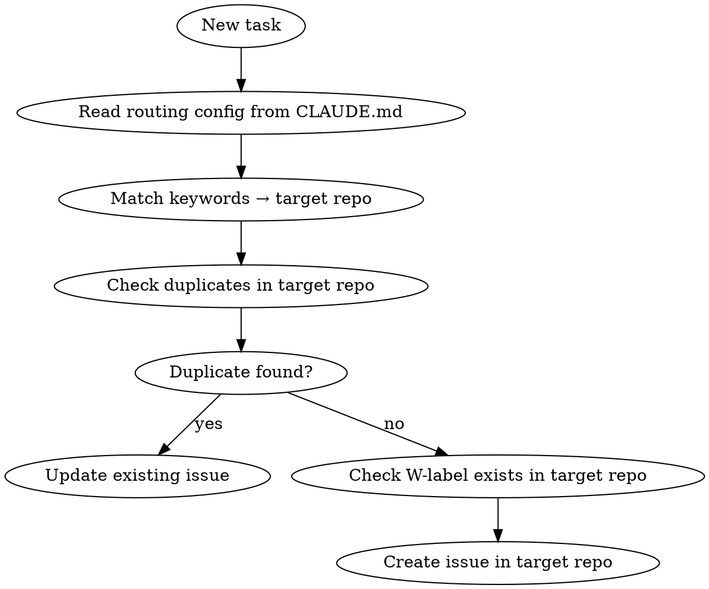

# Task Routing

Route issues to the correct repo using the routing config from CLAUDE.md. Part of the Personal Corp framework: `project-init` → **`task-routing`** → `weekly-planning` / `weekly-retro`.

## How It Works



## Step 1: Read Routing Config

Find the `### Task Routing` section in CLAUDE.md of the **current project** (or the HQ repo if running from there):

```yaml
### Task Routing (which issues go where)
routing:
  - pattern: "bot, broadcast, onboarding"
    repo: owner/bot-repo
  - pattern: "content, lessons"
    repo: owner/content-repo
  - pattern: "strategy, cross-cutting"
    repo: owner/main-repo
```

This config is created by `project-init`. If it doesn't exist — STOP and tell the user to run `project-init` first.

## Step 2: Match Pattern

Match the task description against routing patterns. Rules:

- Match by **keywords in the task**, not by where you happen to be running
- If multiple patterns match, pick the most specific
- If no pattern matches, ask the user: "This doesn't match any routing pattern. Which repo?"
- **Never default to the current repo** — routing must be explicit

## Step 3: Check Duplicates

```bash
# Check target repo
gh issue list -R {target_repo} -s open --json number,title --jq '.[].title'

# Check unified project (if configured)
gh project item-list {project_id} --owner {owner} --format json | \
  python3 -c "import json,sys; [print(i['title']) for i in json.load(sys.stdin)['items']]"
```

If a similar issue exists → update it instead of creating a duplicate.

## Step 4: Check W-label

W-labels (`W13`, `W14`...) are created by `weekly-planning`, not manually.

```bash
# Check if current week label exists in target repo
gh label list -R {target_repo} | grep "W[0-9]"
```

- If W-label exists → use it
- If W-label does NOT exist → **do not create it**. Create the issue without a W-label. It will get labeled during next `weekly-planning` run.

## Step 5: Create Issue

```bash
gh issue create -R {target_repo} \
  -t "prefix: title" \
  -l "{w_label_if_exists}" \
  --body "..."
```

Issue title prefixes follow conventional commits:
- `ops:` — operational task
- `feat:` — new feature
- `fix:` — bug fix
- `content:` — content creation
- `research:` — research task
- `menti:` — mentoring related

## Red Flags — STOP

| You're about to... | Instead... |
|---------------------|-----------|
| Create issue in current repo without checking routing | Read CLAUDE.md routing config first |
| Add W-label that doesn't exist in target repo | Skip label — weekly-planning will add it |
| Add to Project #4 because "it's the main one" | Check which project the target repo uses. Or let GitHub auto-add handle it |
| Create issue without checking duplicates | Search target repo AND unified project |
| Guess the target repo | Ask the user if no pattern matches |
| Create retro:W{NN} label | Only weekly-retro creates these |

## Common Mistakes

| Mistake | Fix |
|---------|-----|
| Issue about bot created in school-brain | Check routing: "bot" → hsl-mozg |
| W14 label created manually | W-labels come from weekly-planning only |
| Duplicate issue across repos | Search unified project before creating |
| No routing config found | Run project-init first |
| Added to wrong GitHub Project | Let GitHub auto-add handle project assignment |

## Minimal Example

```bash
# 1. Read routing from CLAUDE.md
# routing says: "bot, broadcast" → owner/hsl-mozg

# 2. User says: "создай задачу — рассылка по alumni"
# Keywords: "рассылка" matches "broadcast" → target = owner/hsl-mozg

# 3. Check duplicates
gh issue list -R owner/hsl-mozg -s open --json title --jq '.[].title' | grep -i alumni

# 4. Check W-label
gh label list -R owner/hsl-mozg | grep "W13"
# Found → use it

# 5. Create
gh issue create -R owner/hsl-mozg -t "ops: рассылка по alumni" -l "W13"
```
