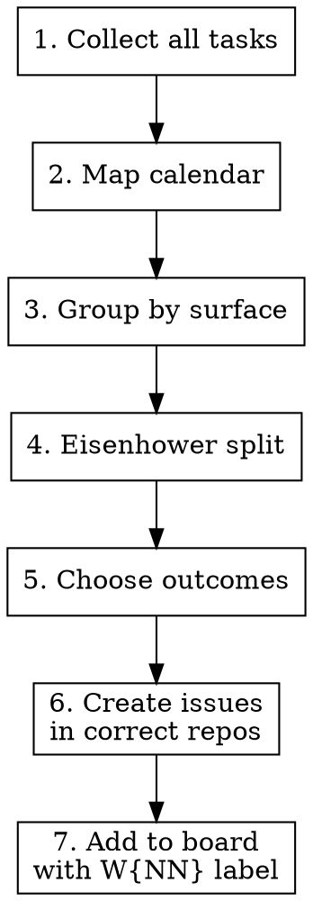

# Weekly Planning

## Overview

Turn retro findings + existing backlog into a prioritized week with clear outcomes, issues in correct repos, and delegation matrix (founder vs agent).

## When to Use

- After weekly retro is complete
- Monday/Tuesday when planning the week
- When user says "план на неделю", "приоритизация", "что делаем"

## Process



### 1. Collect all tasks

Sources to scan:
- Retro backlog (label `retro:W{NN-1}`)
- Open issues across ALL repos: `gh search issues --owner $YOUR_OWNER --state open`
- GitHub Projects for active initiatives
- Calendar events (meetings, lectures, mentoring)
- User input (new tasks from interview)

### 2. Map calendar

Ask user about the week. One question at a time:
- Fixed events (lectures, mentoring, meetings)
- Known deadlines
- New commitments from last week

IMPORTANT: Verify dates. Ask "what day is today?" if unclear.

### 3. Group by surface

Group tasks by where work happens. Use the repos and task routing defined in your `CLAUDE.md` config (set up by `project-init`).

Example surfaces:

| Surface | Description |
|---------|-------------|
| Product delivery | Main product/service repos |
| Sales/pipeline | CRM, sales tooling |
| Content | Blog, videos, social media |
| Strategy | Planning, cross-cutting decisions |
| Infrastructure | Internal tools, automation |

### 4. Eisenhower split with delegation

For each task, classify:

| | Urgent | Not Urgent |
|---|--------|-----------|
| **Important** | Founder does TODAY | Founder schedules this week |
| **Not Important** | Agent does async | Parking lot / drop |

Key question per task: "Does this require founder judgment, or can an agent execute it from the issue description?"

### 5. Choose outcomes

Outcomes = results, not tasks. Format: "By Friday, X is true."

Rules:
- NOT limited to 3 — as many as realistic
- Each outcome has a measurable check
- Include both founder-only and agent-delegated work
- Include B2B/sales if there are active deals — these are outcomes, not bonuses

Example:
```
Outcome: New feature launched
Check: deployed to production, 0 critical bugs by Friday
Founder: final UX decisions, announcement copy
Agent: implementation, tests, deploy script
```

### 6. Create issues in CORRECT repos

CRITICAL: Issue lives where the work happens. Use the task routing from your `CLAUDE.md` config.

```
Issue about backend bug → backend repo
Issue about marketing → marketing repo
Issue about content → content repo
Issue about strategy → main planning repo
```

Before creating any issue:
1. VERIFY current state (check existing issues, files, data)
2. PROPOSE to user
3. CREATE only after verification

Label every issue: `W{NN}` + optionally `retro:W{NN-1}` if from retro.

### 7. Add to unified board

All W{NN} issues → your GitHub Project (from `CLAUDE.md` config: `project_id` and `owner`).

Create or use view "W{NN}" filtered by label.

```bash
# Add to project (use project_id and owner from your config)
gh project item-add $PROJECT_ID --owner $YOUR_OWNER --url $ISSUE_URL

# Verify
gh search issues --owner $YOUR_OWNER --label "W{NN}" --state open
```

## Red Flags — STOP

- Creating all issues in one repo → WRONG, route to correct repo per config
- Creating issue without checking current state → VERIFY FIRST
- Claiming status without checking actual data → VERIFY
- Planning 40h of productive work → budget 60% capacity
- Skipping calendar mapping → leads to conflicts
- Mixing "task" with "outcome" → outcome = result by Friday

## Common Mistakes

| Mistake | Fix |
|---------|-----|
| All issues in one repo | Route to where work happens |
| Issue created without verification | Check issues + files + data first |
| Outcomes = task list | Rewrite as "by Friday, X is true" |
| Ignoring B2B as "bonus" | Active deals with money = outcomes |
| Publishing paid content publicly | Paid content stays in paid repos |
| Assuming data without checking | Verify with `gh issue list` + actual files |
| Fixed 3 outcomes limit | As many outcomes as realistic |

## Integration with weekly-retro

This skill runs AFTER `weekly-retro`. Expected inputs:
- Retro summary with what worked / didn't
- Issues created during retro (label `retro:W{NN-1}`)
- Lessons learned and playbook updates
- New tasks from retro interview

## Setup

This skill reads config from your project's `CLAUDE.md`. Run `project-init` first to generate the config block, or add manually:

```markdown
## Agent Operations Config

### Repos (scanned during retro/planning)
repos:
  - owner/repo-1    # what it does
  - owner/repo-2    # what it does

### GitHub Project
project_id: N
owner: your-github-handle

### Task Routing
routing:
  - pattern: "backend, bugs"
    repo: owner/backend-repo
  - pattern: "content, marketing"
    repo: owner/content-repo
  - pattern: "strategy, cross-cutting"
    repo: owner/main-repo
```

## Quick Reference

```bash
# All tasks for current week
gh search issues --owner $YOUR_OWNER --label "W{NN}" --state open

# By repo
gh search issues --owner $YOUR_OWNER --label "W{NN}" --state open --json repository,number,title

# Close week (Friday)
gh search issues --owner $YOUR_OWNER --label "W{NN}" --state open --json title,repository
# Review: done / spillover / drop
```
