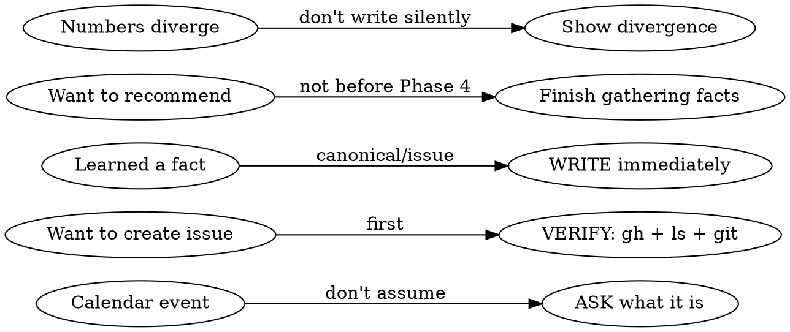
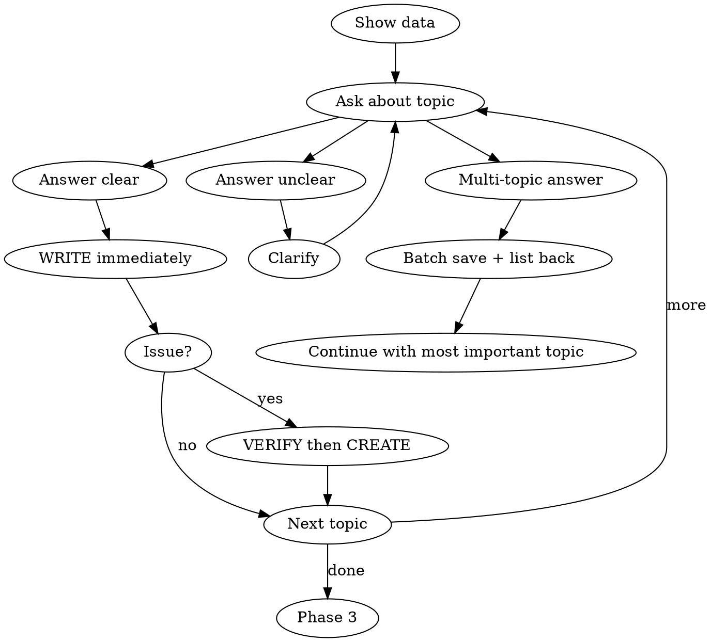

# Weekly Retro

Part of the Personal Corp framework — running a one-person business through AI agents.

Structured weekly retrospective. Gather facts from code and project management tools, interview the founder, capture findings into issues and canonical files.

## Setup

Before first use, define these in your project's `CLAUDE.md`:

```markdown
## Weekly Retro Config

### Repos to scan
List all repos the agent should check for commits:
- ~/Projects/main-app
- ~/Projects/marketing-site
- ~/Projects/docs

### GitHub owner
Your GitHub username or org for issue search:
- owner: your-github-handle

### GitHub Project ID
Project board where retro issues land:
- project_id: 7

### Canonical files (single source of truth)
Files that hold authoritative data — agent must check these before writing numbers:
- data.md — prices, revenue, historical totals
- product.md — current offers
- insights.md — strategic conclusions

### Retro log path
Where retro artifacts are saved. Two files per retro live here:
- `WNN.md` — interview log + final summary
- `WNN-outcomes.md` — outcomes scorecard (planned outcomes vs evidence)

Example:
- retro_log_path: docs/retro/

### Task routing
Map task types to repos so issues land in the right place:
| Type | Repo |
|------|------|
| Backend bugs | main-app |
| Marketing | marketing-site |
| Strategy, cross-cutting | project-brain |

### Interview topics (customize to your business)
Ordered list of areas to cover:
1. Product delivery
2. Sales / pipeline
3. Calendar events
4. New initiatives
5. Research / strategy
6. Open question
```

No separate init skill needed — this section is the setup. Copy the config block above into your `CLAUDE.md`, fill in your values, and the skill is ready.

## Two modes — never mix

Retro = looking back. Planning = looking forward. Finish the retro completely, output the backlog, THEN plan.

If the founder wants to switch to planning before retro is done: "OK, N topics still uncovered: [list]. Skip or quick pass? After that — planning." Give the choice, don't switch silently.

## Iron Rules



1. **ASK don't ASSUME** — Calendar says "Meeting (Name)"? Does NOT mean you know what it was. Ask.
2. **VERIFY before CREATE** — Check for duplicates (`gh issue list --search`) + clarify scope. If fact is NEW and no issue exists — ask the founder: "Is this a task? What exactly should be done, in which repo?" Not every mention = issue.
3. **SAVE immediately** — Learned a fact? Edit/Write right now. "Noted" without writing = not noted.
4. **NO FABRICATION** — Don't invent numbers. Not in canonical files or live stats? Don't write it.
5. **INTERVIEW FIRST** — Data from git/issues is NOT sufficient. The founder knows context that is written nowhere.
6. **One question at a time** — One topic, answer, write it down, next.
7. **CONFLICT RESOLUTION** — If the founder states a number different from canonical source, show the divergence: "data.md says 25, you say 30. Which is correct?" Write only after resolution.
8. **PHASE DISCIPLINE** — Phase 2 (interview) writes ONLY to the retro log file (`$RETRO_LOG_PATH/WNN.md`). Do NOT create issues, do NOT edit canonical files, do NOT touch CRM/contact cards in Phase 2. All canonical mutations are Phase 6 batch. All new issues are Phase 5 batch after explicit founder approve.
9. **OUTCOMES SCORECARD REQUIRED** — Before Phase 2, read `$RETRO_LOG_PATH/WNN-outcomes.md` (written by the planning skill at the start of the week). Fill Status for each outcome via fast subagent (evidence from issues / calendar / canonical files). If the file does not exist — ask founder to reconstruct or skip explicitly, do not silently go into free interview.
10. **WEEK ENDS WITH ZERO OPEN WNN ITEMS** — The retro is not closed until every open issue labeled with the closing week (`retro:WNN` or `WNN`) gets a terminal decision: **close** / **drop** / **promote (to epic)** / **spillover** (with explicit causal reason). "Leave it hanging" is NOT a terminal decision. See Phase 5.5.
11. **NO STALE ROLLOVER** — An item cannot spillover for a 3rd consecutive week. If an issue carries `retro:W{N-2}` + `retro:W{N-1}` and the founder wants another spillover into W{N+1} → STOP. Reformulate as close / drop / promote-to-epic. A re-label is not allowed.

### Numbers trust hierarchy

| Source | Priority | When to use |
|--------|----------|-------------|
| Live system query (DB, API, dashboard) | 1 | Canonical if available |
| Canonical file (dated snapshot) | 2 | Baseline, may be stale |
| Memory / notes | 3 | For context, not decisions |
| Founder (verbal) | VERIFY | Don't write without cross-check against #1-2 |

## Phase 1: Gather Data (before interview, automatic)

**Step 0 — create the retro log file immediately.** Before any data gathering, create `$RETRO_LOG_PATH/WNN.md` (where NN is the closing week). All subsequent writes during the interview land in this single file — not scattered notes, not memory.

All gathering in parallel:

```bash
# 1. Git commits across all repos (use repos from your CLAUDE.md config)
for repo in $YOUR_REPOS; do
  echo "=== $repo ==="
  cd $repo 2>/dev/null && git log --oneline --after="YYYY-MM-DD" --before="YYYY-MM-DD" | head -10
  cd -
done

# 2. GitHub issues closed + updated
gh search issues --owner $YOUR_OWNER --updated "YYYY-MM-DD..YYYY-MM-DD" --json repository,number,title,state

# 3. Open issues on main project board
gh issue list -R $YOUR_OWNER/$YOUR_MAIN_REPO --state open --json number,title --limit 30

# 4. Previous retro carry-over (all open retro:W* labels, not only retro:W{N-1})
gh search issues --owner $YOUR_OWNER --state open --json repository,number,title,labels,createdAt \
  --jq '[.[] | select(.labels[].name | startswith("retro:W")) | {repo: .repository.nameWithOwner, n: .number, title, labels: [.labels[].name | select(startswith("retro:W"))], created: .createdAt}]'
```

Show summary to the user. Ask for a calendar screenshot (if they don't provide one — work with git/issues, don't insist).

### Previous retro carry-over + aging

Group carry-over items by oldest `retro:W*` label. Column "weeks open" = current_week − min(retro:W labels).

```markdown
### Carry-over by age
| Issue | Repo | Title | Open for | Labels |
|---|---|---|---|---|
| #157 | main-app | feature X follow-up | 1 week  | retro:W{N-1} |
| #48  | crm      | client Y invoice    | 2 weeks | retro:W{N-2}, retro:W{N-1} |
| #1   | legal    | tax registration    | 4 weeks | retro:W{N-4}…W{N-1} |

**Stale-warning:** N issues open 2+ weeks. Phase 5.5 will resolve these to terminal decisions before creating the W{N+1} backlog.
```

This list feeds directly into Phase 5.5.

## Phase 1.5: Outcomes scorecard (planned vs actual) — REQUIRED before Phase 2

Without this phase the retro becomes a free conversation about "what happened" instead of an honest check of "what was promised." Outcomes are the only formal link between planning and retro.

### Action

1. Read `$RETRO_LOG_PATH/WNN-outcomes.md` (written by the planning skill at the start of week NN).

2. **If the file does not exist** → STOP and tell the founder explicitly: "Outcomes for WNN were not recorded at planning time — retro will run without plan/fact comparison. Reconstruct retroactively from last week's notes, or skip the scorecard?". Do not silently skip.

3. For each outcome row (O1..ON) gather **evidence** in parallel via fast subagents:
   - Issues in the row's `Issues` column: `gh issue view <N> -R <repo>` — open/closed + last comment
   - Calendar events: query Google Calendar by date
   - Artifacts: `find` / `git log --grep` / canonical-file inspection
   - Communications: relationship-context query (if integration exists)

4. Fill the **Status** column in the same file:

| Symbol | When to set |
|---|---|
| done | All check-criteria met, evidence proves it |
| partial | Some criteria met, what fell short → Notes |
| miss | Not done + evidence it wasn't (issue still open / no files / no comms) — Phase 2 explores why |
| spillover | Moved to W{N+1} with explicit causal link (new issue or re-label) |
| dropped | Removed as irrelevant during the week + reason |

5. Output to founder as a separate block in Phase 1 summary:

```markdown
## Outcomes scorecard WNN

| ID | Outcome | Status | Evidence | Notes |
|---|---|---|---|---|
| O1 | <outcome>     | done       | <issue#> closed, artifact at <path> | — |
| O2 | <outcome>     | partial    | issue closed but Q&A ran long       | bonus 30 min |
| O5 | <outcome>     | miss       | issue still open, 0 broadcasts sent | — |
| O8 | <outcome>     | spillover  | re-labeled retro:W{N+1}             | overdue 3 weeks |

**Summary:** 5 done · 1 partial · 1 miss · 1 spillover · 0 dropped (of 8 outcomes)
**Hit rate:** 62% (5/8 done)
```

6. **Only miss / partial / spillover rows** become Phase 2 interview topics — founder explains why. Done rows are already proven by evidence; don't spend founder time relitigating them.

### Anti-patterns

- **Did not open the outcomes file** → Phase 2 turns into free discussion. Founder loses honest plan-vs-fact accountability.
- **Filled Status without evidence** → "done" set on memory alone, false-positive risk. Every "done" requires an evidence row.
- **Skipped Phase 1.5 because "it's obvious"** → STOP. If the outcomes file exists, reading and filling Status is not optional.

### When outcomes file is missing

Possible causes:
- WNN was the first week using this process (no precedent)
- Founder skipped the planning skill's outcomes-write step
- File was lost / mis-pathed

Action:
1. Tell founder explicitly: "No outcomes recorded for WNN. Options: (a) reconstruct retroactively from the prior week's retro summary + current tasks file, (b) skip scorecard and go into open interview."
2. If (a) — mark the reconstructed file with `**Reconstructed:** YYYY-MM-DD (no original plan)` in its header. Reconstructed outcomes are baseline only — not as reliable as planned ones (selection bias).
3. Fix the cycle going forward: the planning skill must write the outcomes file at the start of next week.

## Phase 2: Interview (core of retro)



### Multi-topic response protocol

When the answer covers multiple topics: (1) WRITE each fact immediately (batch is OK), (2) list back to founder: "Saved: X, Y, Z — correct?", (3) continue with the most important uncovered topic, (4) return to skipped items from interview order later.

### Interview order

Use the topics from your `CLAUDE.md` config. Default order:

1. **Product delivery** — what shipped, how it went, what to improve
2. **Sales / pipeline** — numbers, conversions, new leads
3. **Calendar events** — ask "what was this?" for EACH unclear entry
4. **New initiatives** — what started, why, current status
5. **Research / strategy** — what led to decisions, what's shelved
6. **What we didn't cover** — open question

### Verify checklist (BEFORE each issue)

```bash
# Check for duplicate issues
gh issue list -R $YOUR_OWNER/$REPO --search "{keywords}" --state all
```

### Where to write during interview

| What you learned | Where to write IMMEDIATELY |
|-----------------|---------------------------|
| Fact about project/product | Canonical file (data.md, product.md, etc.) |
| Date/plan changed | Relevant config file + any dependent docs |
| Process lesson/insight | Insights file or playbook |
| Action item | GitHub issue in the CORRECT repo (see task routing in config) |

## Phase 3: Advisory analysis (optional)

Offer if retro surfaces 3+ unresolved risks or founder asks.

3 sub-agents in parallel:
- **Strategist** — patterns, risks, missed opportunities
- **Operations** — processes, automation, broken triggers
- **Growth** — funnel, conversion, missed revenue with numbers

## Phase 4: Compile summary

The summary is written to the same `$RETRO_LOG_PATH/WNN.md` that has been collecting interview notes since Phase 1. Append the summary section at the top or bottom of that file — do not create a separate file.

```markdown
## Retro WNN (dates)

### Outcomes scorecard
[copy the table from $RETRO_LOG_PATH/WNN-outcomes.md Status section + hit rate %]

### Done
- ...

### In progress
- ...

### Not touched
- ...

### Carry-over (from previous retro)
- [open items from retro:W{N-1}]

### Lessons -> system updates
| Lesson | What was updated |
```

If you have 4+ retros with outcomes scorecards, add a trend row below the table:

```
Hit-rate trend: W{N-3} 70% / W{N-2} 62% / W{N-1} 81% / WNN 75%
```

This gives the founder visibility on whether the process is improving or degrading.

## Phase 5: Create retro backlog

Issues go to the CORRECT repos (per task routing in your config):

```bash
# Create retro label
gh label create "retro:WNN" -R $YOUR_OWNER/$REPO --color "D4C5F9"

# Each issue -> correct repo + label + project board
gh issue create -R $YOUR_OWNER/$REPO -t "..." -b "..." -a $YOUR_OWNER --label "retro:WNN"
gh project item-add $YOUR_PROJECT_ID --owner $YOUR_OWNER --url {url}
```

Final table:

```markdown
### Backlog retro:WNN
| # | Repo | Task |

Filter: `gh search issues --owner $YOUR_OWNER --label "retro:WNN" --state open`
```

## Phase 5.5: Triage to zero — every open WNN item gets a terminal decision

**Goal:** by end of retro, **zero open issues** carrying the `retro:WNN` label of the closing week. Iron Rule 10.

**Trigger:** runs after Phase 5 (new backlog created). The skill does NOT proceed to Phase 6 until this step completes.

### Action

1. Collect all open issues with `retro:WNN` cross-repo:

```bash
gh search issues --owner $YOUR_OWNER --label "retro:WNN" --state open \
  --json repository,number,title,labels,createdAt,assignees
```

2. For **each** issue, a fast subagent gathers status evidence in parallel (5-10 issues per batch): what shipped, what didn't, last commit/comment, any blocker.

3. Present a triage table to the founder with a proposed terminal decision per row:

```markdown
### Phase 5.5 — Triage open WNN

| # | Repo | Title | Evidence | Propose | Reason |
|---|---|---|---|---|---|
| 157 | main-app | feature X follow-up | 0 commits in 5 days, scope obsolete | **drop** | initiative cancelled |
| 22  | crm      | client Y sync       | meeting on 02.05, notes saved      | **close** | done — evidence at crm/.../notes.md |
| 48  | legal    | tax registration    | open 4 retros, blocker = external party | **promote** | not weekly-scope, becomes epic |
| 99  | docs     | guide draft         | active work, deadline in 5 days    | **spillover → W{N+1}** | normal in-flight |

**Stale-rollover check (Iron Rule 11):** N issues already spilled over 2+ times — for these spillover is FORBIDDEN; choose close/drop/promote only.
```

4. Founder approves decisions per row (batch is fine: "all as proposed except #99"). Execute per row:

| Decision | Action |
|---|---|
| **close** | `gh issue close <N> -R <repo> -c "<evidence>"`; verify via subagent that state went to closed |
| **drop** | `gh issue close <N> -R <repo> -c "dropped: <reason>"` + write the decision to your decisions/insights canonical file (without recording the reason it becomes silent abandonment) |
| **promote** | remove `retro:WNN` label, add `epic:<slug>` + create a parent epic issue if missing + add to project as long-running |
| **spillover** | re-label to `retro:W{N+1}` + comment in the issue with the causal blocker / reason + add a row to `$RETRO_LOG_PATH/W{N+1}-outcomes.md` (create file if absent) |

5. **Verify after batch:** `gh search issues --owner $YOUR_OWNER --label "retro:WNN" --state open` → must return **0 results**. If not — STOP, do not proceed to Phase 6.

### Red flags

- Founder says "leave it hanging, I'll deal with it later" → STOP. "Later" = silent rollover, which is exactly what created the current backlog. Only 4 terminal decisions are allowed. If the founder genuinely can't choose now, default to `spillover` with the reason "founder requested defer" + auto-add to next week's outcomes file (so it comes back in Phase 1.5 next retro as accountability).
- Spillover without a reason → STOP. The reason is the blocker. Without it the item drifts forever.
- Skill tries to enter Phase 6 while `gh search ... --state open` ≠ 0 → STOP, return to Phase 5.5.
- A stale-rollover (3rd spillover) is being proposed to founder → STOP. Reformulate as close/drop/promote-to-epic — don't offer "spillover" as an option.

## Phase 6: Canonical updates + Wrap-up

1. Retro summary stays in `$RETRO_LOG_PATH/WNN.md` (same file that's been collecting Phase 1-5 notes; do not move to an archive directory).
2. Outcomes scorecard stays in `$RETRO_LOG_PATH/WNN-outcomes.md` with final Status column filled.
3. Canonical updates (batch — only here, never in Phase 2):
   - Insights / strategy file — new lessons of the week + caveats on hypotheses
   - Numbers / data file — fresh snapshots if anything changed
   - Roadmap / focus file — money-list, dropped tracks, new criticals
   - CLAUDE.md — new architectural rules surfaced by retro
4. Show diff of all changed canonical files
5. Ask: "Commit changes?" (do NOT commit automatically)
6. If yes, one atomic commit per repo: `docs: weekly retro WNN`
7. Do NOT push without explicit request

## Red Flags — STOP

- Creating issue without `gh issue list --search` first -> STOP, check for duplicates
- Writing a number without source (canonical file, live stats) -> STOP, remove it
- Assuming what a calendar event was -> STOP, ask
- Giving recommendations before interview is done -> STOP, gather facts first
- Saying "noted" without Edit/Write -> STOP, actually write it
- Founder wants to switch to planning -> STOP, list uncovered topics, give the choice
- Founder's numbers diverge from canonical -> STOP, show divergence, ask
- Entering Phase 2 without reading `$RETRO_LOG_PATH/WNN-outcomes.md` -> STOP, Phase 1.5 is mandatory
- Filling a `done` Status without evidence -> STOP, every `done` needs an issue closed / artifact found / payment confirmed via subagent
- Phase 2 discussing `done` outcomes -> STOP, founder time wasted; jump to miss / partial / spillover rows
- Creating issues or editing canonical files in Phase 2 -> STOP, copy into the retro log, batch in Phase 5/6
- Trying to enter Phase 6 while open `retro:WNN` issues remain -> STOP, return to Phase 5.5
- Proposing a 3rd consecutive spillover for an issue -> STOP, reformulate as close / drop / promote-to-epic

## Common Rationalizations

| Rationalization | Reality |
|----------------|---------|
| "Calendar says Meeting — must be a meeting" | Calendar titles are unreliable. Ask. |
| "Git data is enough for retro" | Git doesn't know context: why, what was decided, what changed |
| "I'll write it later, let me gather everything first" | Later = never. Write immediately |
| "This is obviously a main-repo issue" | Route to the correct repo per your task routing config |
| "Config says date X — so that's the date" | Plans change. Ask for current status |
| "Roughly $X revenue" | Not in canonical files? Don't write it. Fabrication is unacceptable |
| "Founder said 30 — so it's 30" | Verbal numbers -> cross-check with live stats/canonical. Show divergence |
| "This mention needs an issue" | Not every mention = issue. Ask: "Is this a task?" |
| "Outcomes file is missing, I'll just run an open interview" | STOP. Tell the founder explicitly and offer reconstruct/skip. Silent skip degrades next week's planning. |
| "I remember this outcome was done" | Memory is not evidence. Each `done` row needs an issue closed / artifact found via subagent before marking. |
| "We'll triage next week — leave the open WNN items as-is" | This is what created the current backlog. Iron Rule 10: zero open WNN items before Phase 6, four terminal decisions only. |
