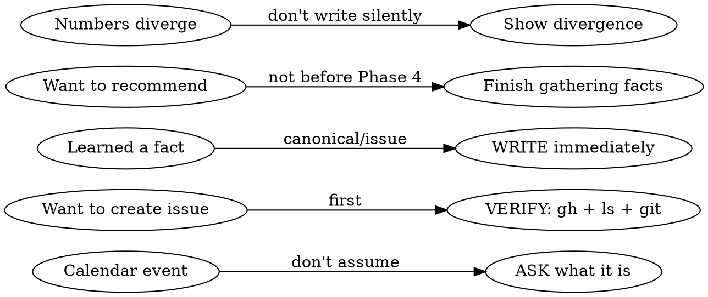
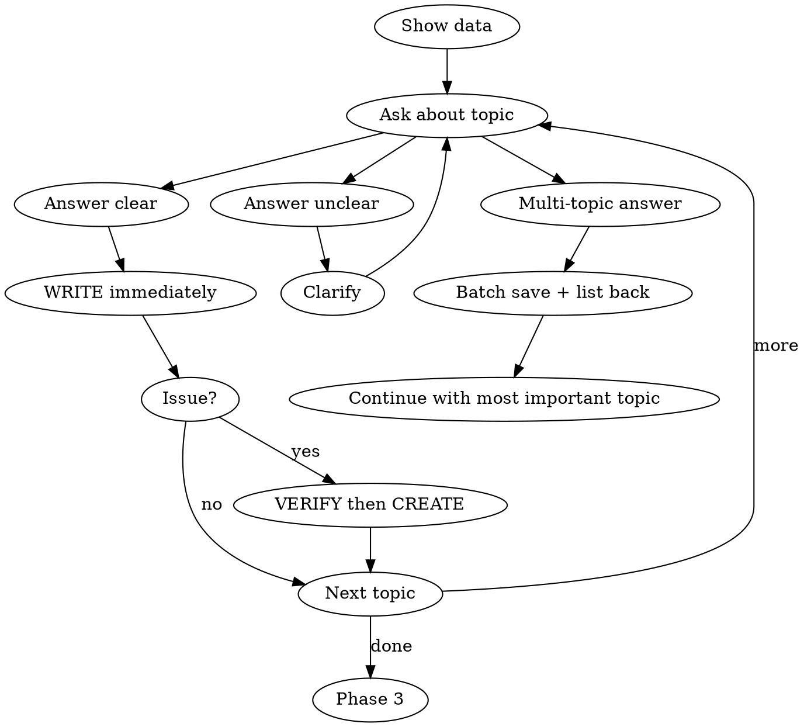

# Weekly Retro

Part of the Personal Corp framework — running a one-person business through AI agents.

Structured weekly retrospective. Gather facts from code and project management tools, interview the founder, capture findings into issues and canonical files.

## Setup

Before first use, define these in your project's `CLAUDE.md`:

```markdown
## Weekly Retro Config

### Repos to scan
List all repos the agent should check for commits:
- ~/Projects/main-app
- ~/Projects/marketing-site
- ~/Projects/docs

### GitHub owner
Your GitHub username or org for issue search:
- owner: your-github-handle

### GitHub Project ID
Project board where retro issues land:
- project_id: 7

### Canonical files (single source of truth)
Files that hold authoritative data — agent must check these before writing numbers:
- data.md — prices, revenue, historical totals
- product.md — current offers
- insights.md — strategic conclusions

### Retro log path
Where retro summaries are saved:
- docs/retro/

### Task routing
Map task types to repos so issues land in the right place:
| Type | Repo |
|------|------|
| Backend bugs | main-app |
| Marketing | marketing-site |
| Strategy, cross-cutting | project-brain |

### Interview topics (customize to your business)
Ordered list of areas to cover:
1. Product delivery
2. Sales / pipeline
3. Calendar events
4. New initiatives
5. Research / strategy
6. Open question
```

No separate init skill needed — this section is the setup. Copy the config block above into your `CLAUDE.md`, fill in your values, and the skill is ready.

## Two modes — never mix

Retro = looking back. Planning = looking forward. Finish the retro completely, output the backlog, THEN plan.

If the founder wants to switch to planning before retro is done: "OK, N topics still uncovered: [list]. Skip or quick pass? After that — planning." Give the choice, don't switch silently.

## Iron Rules



1. **ASK don't ASSUME** — Calendar says "Meeting (Name)"? Does NOT mean you know what it was. Ask.
2. **VERIFY before CREATE** — Check for duplicates (`gh issue list --search`) + clarify scope. If fact is NEW and no issue exists — ask the founder: "Is this a task? What exactly should be done, in which repo?" Not every mention = issue.
3. **SAVE immediately** — Learned a fact? Edit/Write right now. "Noted" without writing = not noted.
4. **NO FABRICATION** — Don't invent numbers. Not in canonical files or live stats? Don't write it.
5. **INTERVIEW FIRST** — Data from git/issues is NOT sufficient. The founder knows context that is written nowhere.
6. **One question at a time** — One topic, answer, write it down, next.
7. **CONFLICT RESOLUTION** — If the founder states a number different from canonical source, show the divergence: "data.md says 25, you say 30. Which is correct?" Write only after resolution.

### Numbers trust hierarchy

| Source | Priority | When to use |
|--------|----------|-------------|
| Live system query (DB, API, dashboard) | 1 | Canonical if available |
| Canonical file (dated snapshot) | 2 | Baseline, may be stale |
| Memory / notes | 3 | For context, not decisions |
| Founder (verbal) | VERIFY | Don't write without cross-check against #1-2 |

## Phase 1: Gather Data (before interview, automatic)

All in parallel:

```bash
# 1. Git commits across all repos (use repos from your CLAUDE.md config)
for repo in $YOUR_REPOS; do
  echo "=== $repo ==="
  cd $repo 2>/dev/null && git log --oneline --after="YYYY-MM-DD" --before="YYYY-MM-DD" | head -10
  cd -
done

# 2. GitHub issues closed + updated
gh search issues --owner $YOUR_OWNER --updated "YYYY-MM-DD..YYYY-MM-DD" --json repository,number,title,state

# 3. Open issues on main project board
gh issue list -R $YOUR_OWNER/$YOUR_MAIN_REPO --state open --json number,title --limit 30

# 4. Previous retro carry-over
gh search issues --owner $YOUR_OWNER --label "retro:W{N-1}" --state open --json repository,number,title
```

Show summary to the user. Ask for a calendar screenshot (if they don't provide one — work with git/issues, don't insist).

### Previous retro carry-over

Show open items from `retro:W{N-1}` as a separate block: "Still open from last retro: [list]". Include in Phase 4 summary.

## Phase 2: Interview (core of retro)



### Multi-topic response protocol

When the answer covers multiple topics: (1) WRITE each fact immediately (batch is OK), (2) list back to founder: "Saved: X, Y, Z — correct?", (3) continue with the most important uncovered topic, (4) return to skipped items from interview order later.

### Interview order

Use the topics from your `CLAUDE.md` config. Default order:

1. **Product delivery** — what shipped, how it went, what to improve
2. **Sales / pipeline** — numbers, conversions, new leads
3. **Calendar events** — ask "what was this?" for EACH unclear entry
4. **New initiatives** — what started, why, current status
5. **Research / strategy** — what led to decisions, what's shelved
6. **What we didn't cover** — open question

### Verify checklist (BEFORE each issue)

```bash
# Check for duplicate issues
gh issue list -R $YOUR_OWNER/$REPO --search "{keywords}" --state all
```

### Where to write during interview

| What you learned | Where to write IMMEDIATELY |
|-----------------|---------------------------|
| Fact about project/product | Canonical file (data.md, product.md, etc.) |
| Date/plan changed | Relevant config file + any dependent docs |
| Process lesson/insight | Insights file or playbook |
| Action item | GitHub issue in the CORRECT repo (see task routing in config) |

## Phase 3: Advisory analysis (optional)

Offer if retro surfaces 3+ unresolved risks or founder asks.

3 sub-agents in parallel:
- **Strategist** — patterns, risks, missed opportunities
- **Operations** — processes, automation, broken triggers
- **Growth** — funnel, conversion, missed revenue with numbers

## Phase 4: Compile summary

```markdown
## Retro WNN (dates)

### Done
- ...

### In progress
- ...

### Not touched
- ...

### Carry-over (from previous retro)
- [open items from retro:W{N-1}]

### Lessons -> system updates
| Lesson | What was updated |
```

## Phase 5: Create retro backlog

Issues go to the CORRECT repos (per task routing in your config):

```bash
# Create retro label
gh label create "retro:WNN" -R $YOUR_OWNER/$REPO --color "D4C5F9"

# Each issue -> correct repo + label + project board
gh issue create -R $YOUR_OWNER/$REPO -t "..." -b "..." -a $YOUR_OWNER --label "retro:WNN"
gh project item-add $YOUR_PROJECT_ID --owner $YOUR_OWNER --url {url}
```

Final table:

```markdown
### Backlog retro:WNN
| # | Repo | Task |

Filter: `gh search issues --owner $YOUR_OWNER --label "retro:WNN" --state open`
```

## Phase 6: Wrap-up

1. Save retro summary to your configured retro log path (e.g. `docs/retro/retro-WNN.md`)
2. Show diff of all changed canonical files
3. Ask: "Commit changes?" (do NOT commit automatically)
4. If yes, one atomic commit: `docs: weekly retro WNN`
5. Do NOT push without explicit request

## Red Flags — STOP

- Creating issue without `gh issue list --search` first -> STOP, check for duplicates
- Writing a number without source (canonical file, live stats) -> STOP, remove it
- Assuming what a calendar event was -> STOP, ask
- Giving recommendations before interview is done -> STOP, gather facts first
- Saying "noted" without Edit/Write -> STOP, actually write it
- Founder wants to switch to planning -> STOP, list uncovered topics, give the choice
- Founder's numbers diverge from canonical -> STOP, show divergence, ask

## Common Rationalizations

| Rationalization | Reality |
|----------------|---------|
| "Calendar says Meeting — must be a meeting" | Calendar titles are unreliable. Ask. |
| "Git data is enough for retro" | Git doesn't know context: why, what was decided, what changed |
| "I'll write it later, let me gather everything first" | Later = never. Write immediately |
| "This is obviously a main-repo issue" | Route to the correct repo per your task routing config |
| "Config says date X — so that's the date" | Plans change. Ask for current status |
| "Roughly $X revenue" | Not in canonical files? Don't write it. Fabrication is unacceptable |
| "Founder said 30 — so it's 30" | Verbal numbers -> cross-check with live stats/canonical. Show divergence |
| "This mention needs an issue" | Not every mention = issue. Ask: "Is this a task?" |
